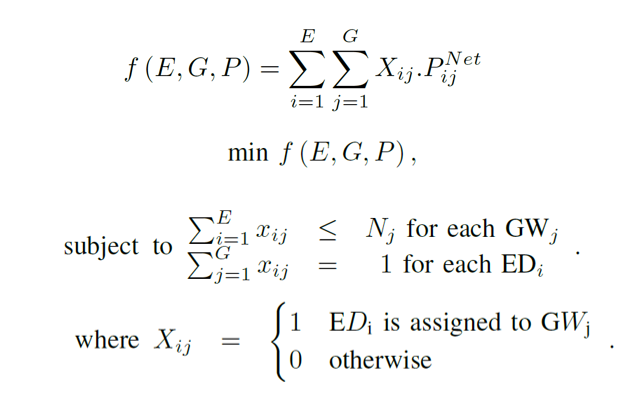
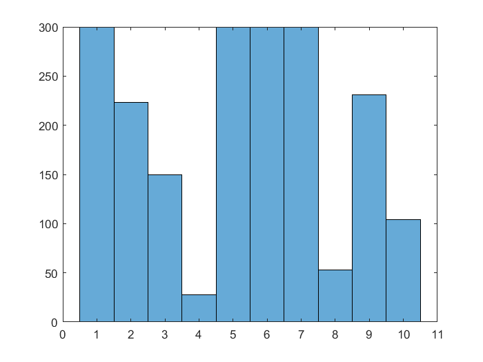
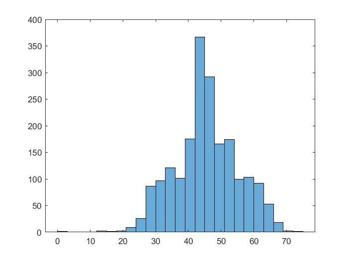

# Integer Linear Programming Model for Optimizing  Connected Start Network Topology 

## Theory 
Optimization model that aims minimizing an objective variable of network quality (in this case, RSSI) by finding optimal assingment of end devices/UE to Gateways or Basestations. It is first presented in the research in 

Rady Mina, Hafeez Maryam, Ali, S.A.R, “Computational Methods for Network-Specific and Network-Agnostic IoT Low Power Wide Area Networks (LPWAN)” [pending review: IEEE IoT Journal]. 2018 

The model can be formalized as:



The file `MatlabVars.mat` contains sample network input (relative RSSIs among sample some GWs and some EDs) which the code wil use to provide the optimal link assignment matrix. The code should provide this output in the console:
```
>> ClusterAssignment_LP
LP:                Optimal objective value is 89530.000000.                                         


Optimal solution found.

Intlinprog stopped at the root node because the objective value is within a gap tolerance of the optimal value,
options.AbsoluteGapTolerance = 0 (the default value). The intcon variables are integer within tolerance,
options.IntegerTolerance = 1e-05 (the default value).
```

Furthermore, the code provides the optimal topology in terms of 3 variabls:
+ **final**: which contains the binary assignment matrix
+ **final_gws**: which contains the ID of the actual GW assigned for each device.
+ **final_links**: which contains the link RSSI (or whatever cost parameter you use) for each ED. 

## Results Visualization
Finally, the code provides the following histograms for:

### A. Load for each Gateway


### B. Relative RSSI Saturation in the Network

