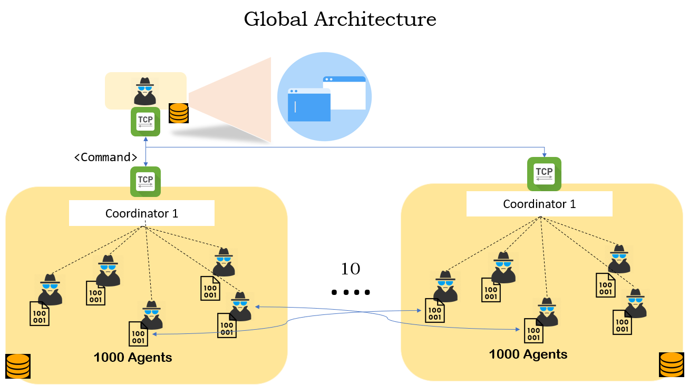
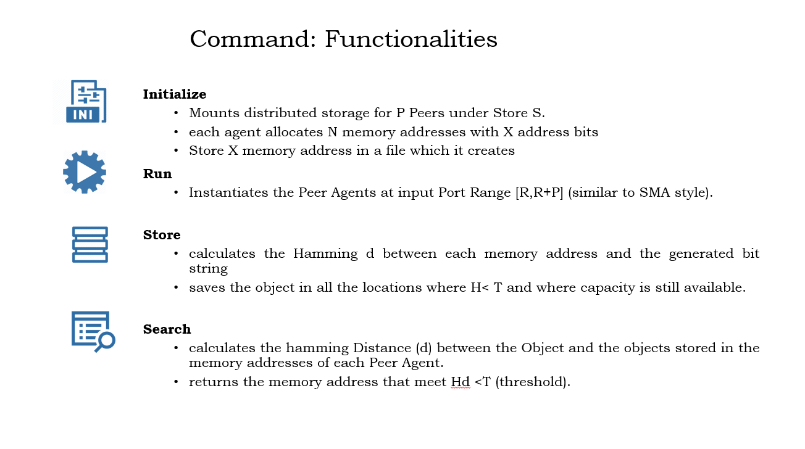
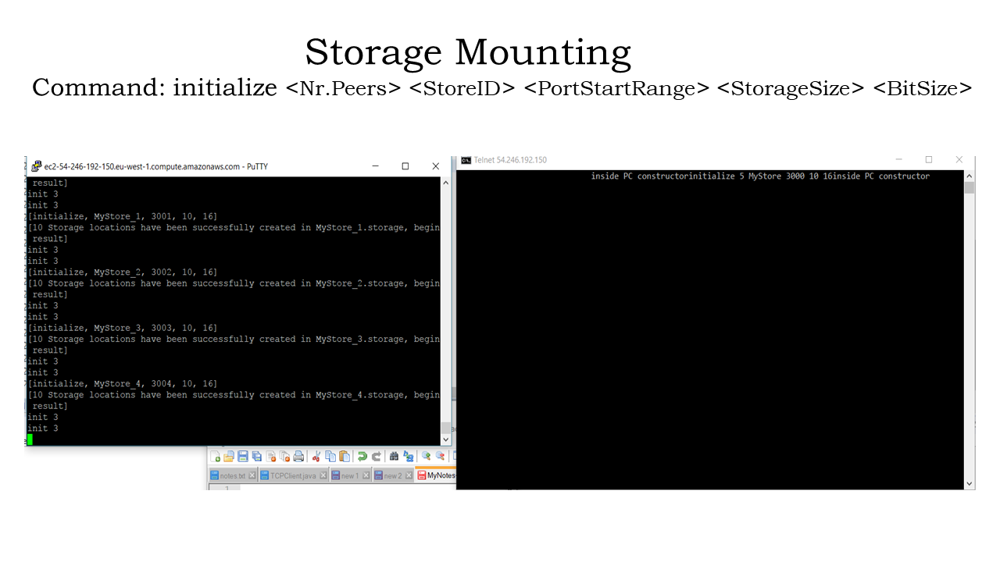
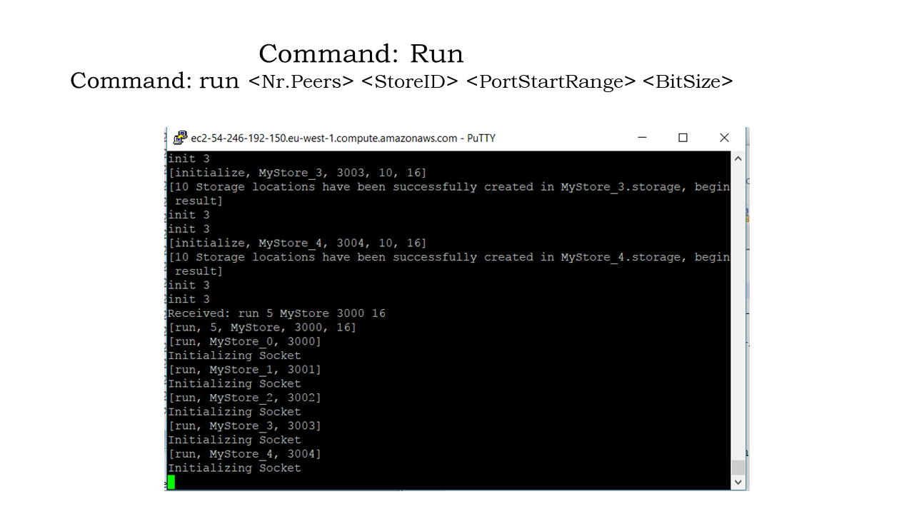
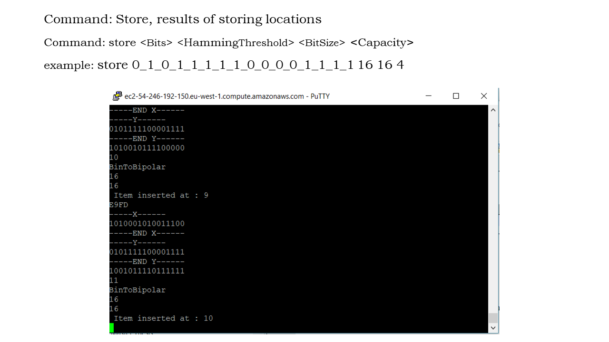
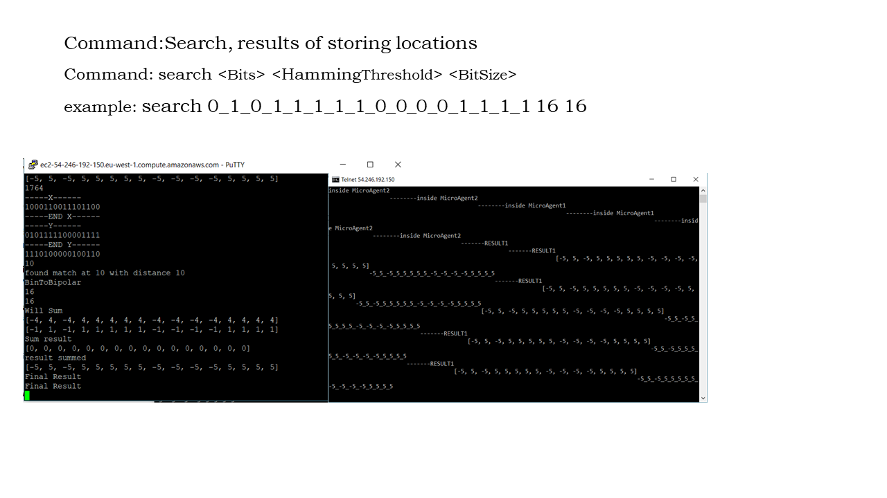
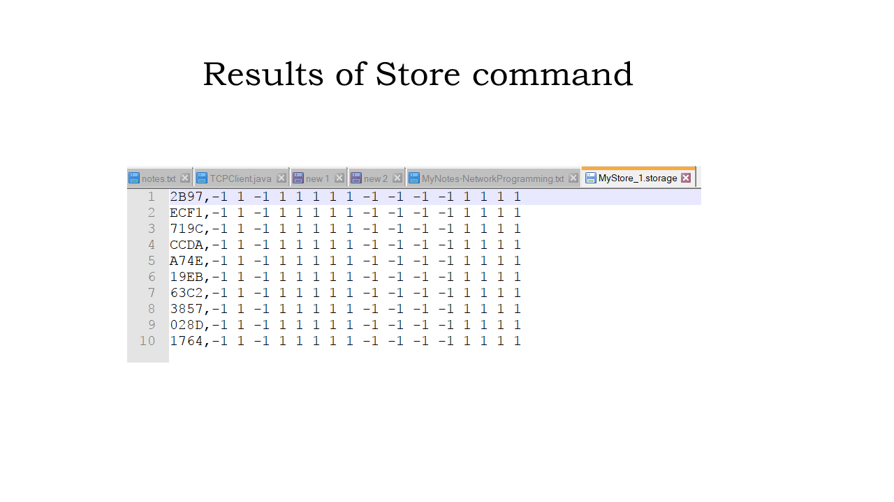
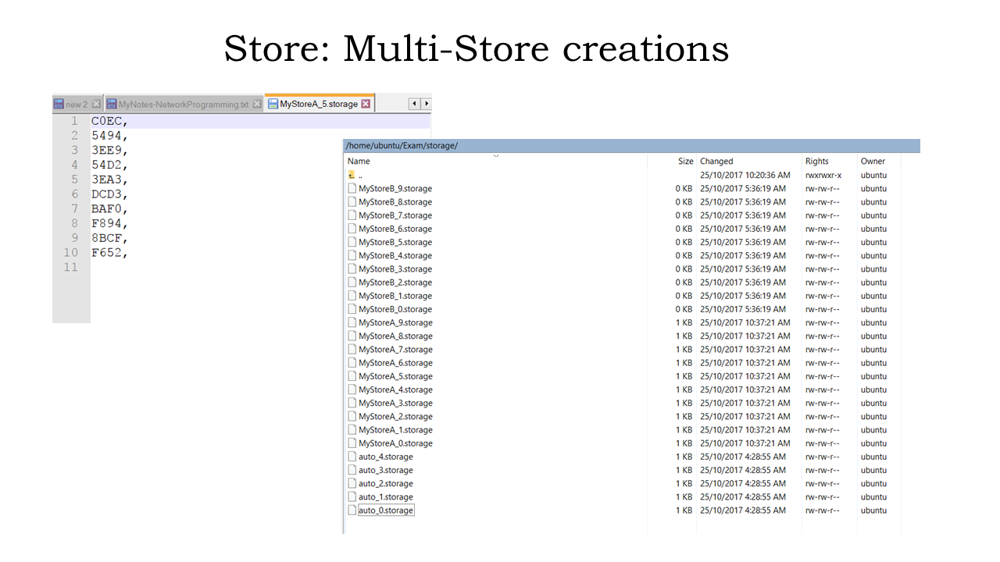
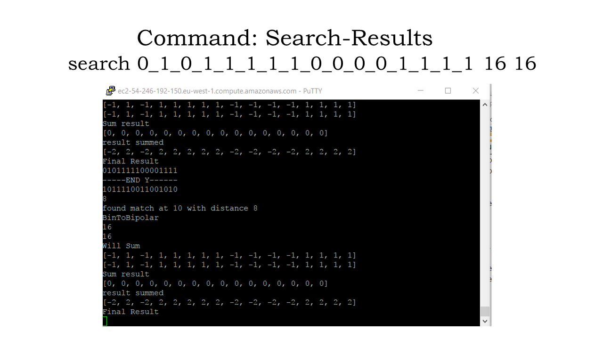

# P2P Neural Distributed Associative Memory Storage System

This system was done as final project for Dr. Evgeny Osipov at Lulea University of Technology in Sweden. It contains a storage agent and a master controller. The storage agent, which is stored on a node in a stogatge cluster, manages local storage RW  requests and search queries. It simulates the neural memory and it is more specicifed according to the original [home exam assignment](Images/Exam.pdf) .

## System Features

+ Allows multiple storage size addresses 
+ Dynamic Capacity Allocation
+ Compressed addresses - uses hex format to store memory adds
+ Its stateless - every request is independent from other request, 
+ Peers don’t need to keep session info
+ Can respond to multiple requests of multiple storage systems at same time 

## Architecture Overview

## Storage Agent CLI commands

## Master GUI 

The current Master GUI is not completely functional because of some problems with intializing concurrent TPC connections. Future releases may better depend on Jade agent interfacing. 

# Demo Screenshots
## Node Local Disk Storage Mounting

## Initialize Storage Agents

## Processing Neural Memory Store Command

## Processing Neural Memory Search Command

## Storage File View

## Node Multiple Store Mounting

## Search Results

