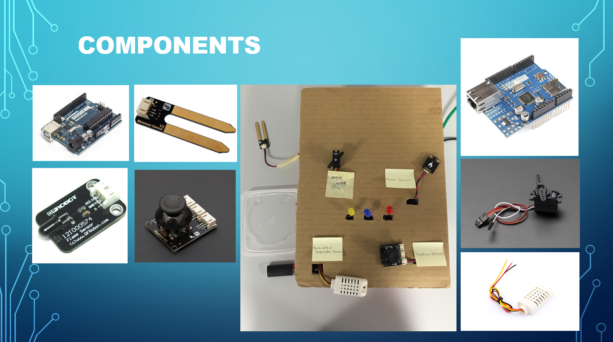
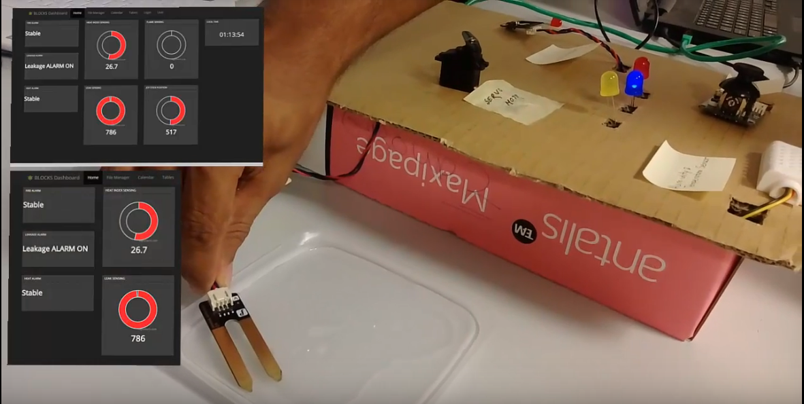
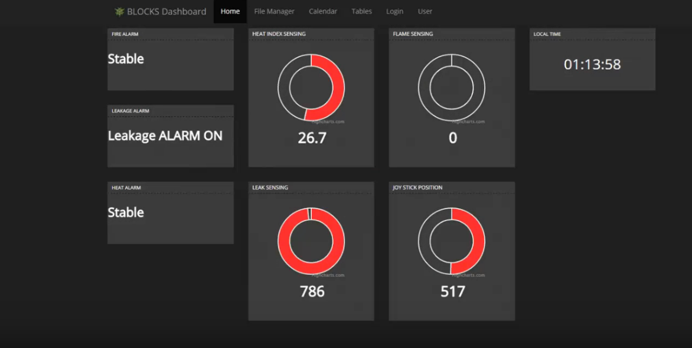

# IoT SCADA Toy Prototype for PERCCOM Hackathon
The prototype performs production line semi-automated steering as it allows manual intervention in production line control speed and direction by JoyStick Lever
It provides remote monitoring, detection and response to leakage, over-heating or fire based as it transmits sensor readings over Ethernet Interface for web access. 

## System Components

## SCADA Live Monitoring Interface

## Live Demo Presentation Recording

# Installation
MainController.ino contains the Arduino controller code which exposes the system operation in XML format for requests on Ethernet shield. You can integrate it with your own dashabord. Demonstrated dashboard code is currently not available. 

