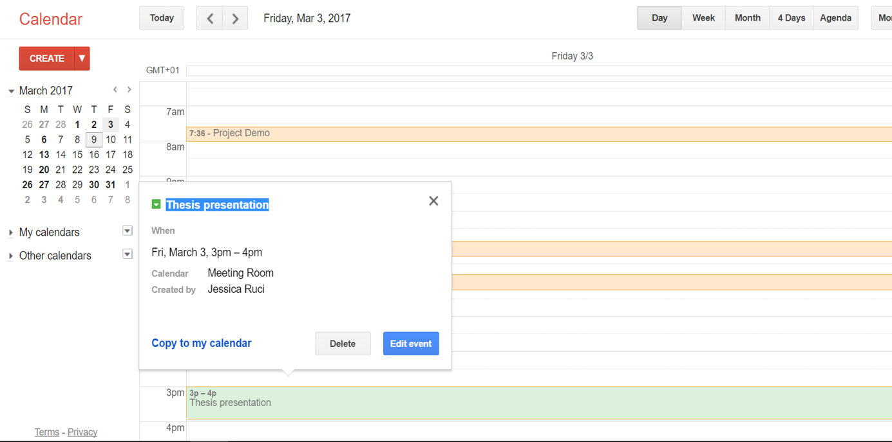
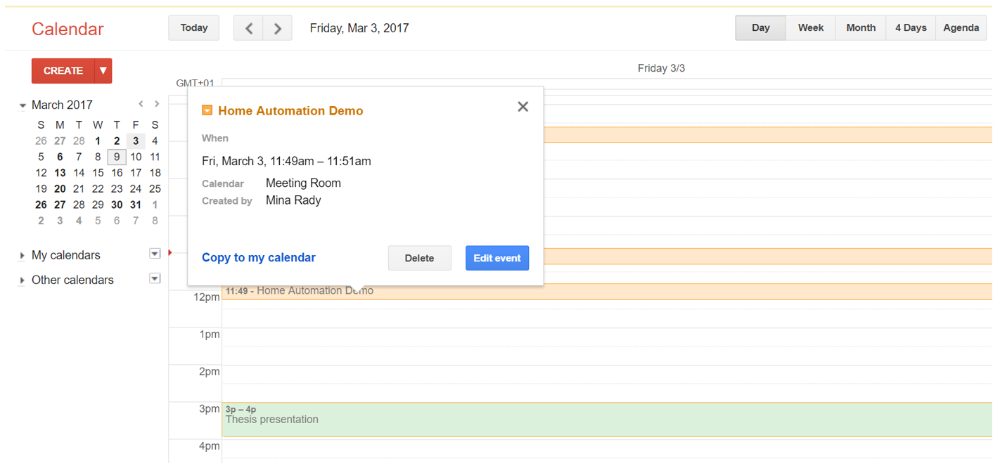

# Sensing As A Service for Smart Facility Management

 Based on FHEM Home Automation Platform and FS20 sensors, we created a service layer above sensors such as temperature, door, and motion and electric switch actuators. Base on calendar reservations, the system enables electrical devices. System would send email alarms if motion detected or door opened during unscheduled room time (unauthorized access) and system would ensure lights are off during unreserved room times.
 
## Usecases

**Pre-meeting:** our system synchronizes with existing organizational and personal calendar systems with (iCal format) such as Google Calendar. Consequently, all room automation actions are done according to that calendar. Moreover, as long as room is unoccupied, the system displays the upcoming schedule of reservation during the day.

**During meeting:** system monitors and displays room comfort settings (temperature and humidity). Furthermore, it displays the current meeting subject as defined in the organizational calendar entry during reservation.

**After meeting:** the system waits for motion detection to report no-motion and then it turns powers off devices in the room. 

**Security monitoring:** the system monitors unauthorized access in the room through motion detection and door status. Whenever a meeting room is not occupied and no meeting is held, unexpected access to the room will alert the facility administrator by sending an email. 

## Sample Demo Screenshots:
### Google Calendar Integration
In this example, we show collaborative reservation by two different users from their accounts to the meeting room at two different times. 

### Room Status Display
Showing status and upcoming reservations. In the updated version on this release, there is additional active controls for appliances

### Email Warning System:
The system successfully reports by email the exact time when an unauthorized presence is detected (in this example, door was detected to be open outside of meeting room reservation schedule).

## Context

## Hardware Components
 We have integrated the following hardware components:
-	FS20-PIRI-2 Motion sensor.
-	FS20DI Dimmer.
-	FHT80b Thermostat.
-	HMS100TF Humidity/temperature sensor.
-	FS20 TFK door sensor.
-	A light bulb to display energy on/off behavior
## Software Components
-	A calendar virtual device which provides an iCal interface with the Google Calendar of the organization. 
-	An internal email function using Perl script that contains our automatic email server configuration (SMTP URL, port, username, password).
-	Internal scripting triggers (at,notify) that store different room status readings in external files to be accessed by other components external to FHEM.
- Apache Server on RPI

# Getting Started

+ HTML folder has the server files which will be installed on the Apache server on RPI
  - index.php contains the main interface which shows room status and displays interactive switches for controlling the appliances.
  - js/demo.js contains the client adapter which translates client-side requests to backgroudn server-side calls to API at service.php. 
  - service.php contains the service layer which translates client side requests to back-end FHEM server API calls
  
+ fhem file: contains an export of the FHEM server configuration for different FS20 sensors and actuators used in the project
+ 99_myUtils.pm: contains PERL customizations of FHEM server including e-mail function.
+ door_status, room_status, warning_status: ctonains the different status registry files that are updated by FHEM events depending on motion sensor, door sensor and google clendar reading
+ room_display: contains the view which will be displayed at room entrance monitor to show a summary of the room status such as: next meeting scheduled on xyz titled ABC, or no upcoming room reservations today., or room currently busy bu meeting ABC

### Installing on RPI

Ensure: 
+ FHEM is installed and configured properly for sensors/actuators radio sync. 
  - Then import fhem file and 99_myUtils.pm for the configutation
+ Apache server is installed
  - copy html contents into www directory and update all IPs in the code file to the new IP of RPI

## Acknowledgments
To PERCCOM home automation lab at Lappeenranta University of Technology, Finland in Spring 2017.
