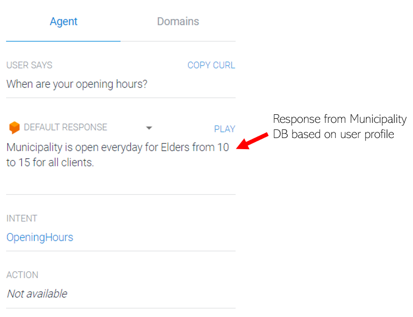
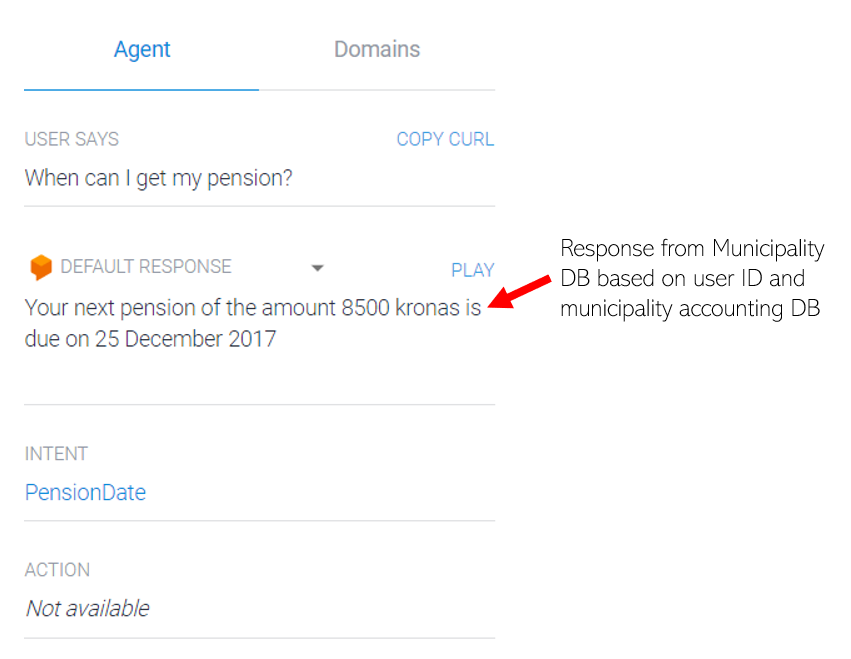
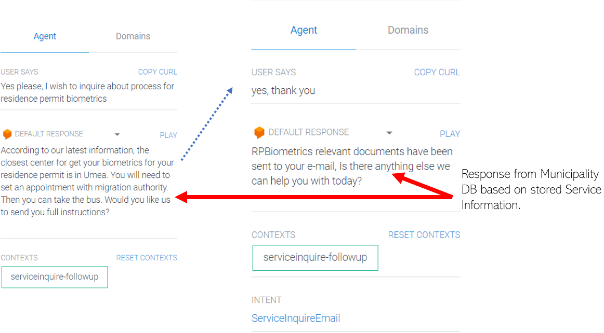
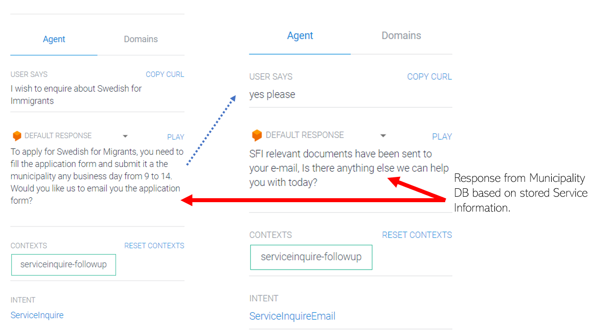

# Service-Based Virtual Personal Assistant for e-Government Services

This project was done as part of the Arctic Challenge Hackathon in Sweden. A successful live demo was demonstrated for the Skelleftea Municipality.

The purpose of the system is to create a service layer that allows governments to automate their service provision through VPAs. We create a dialog flow using API.AI which handles different categories of requests related to elderly health care, transfer to specific medical assistance depending on the specialization demanded by the client, individual information inquiry such as expected pension transfer date, or municipality opening hour. The service is connected to a database and an e-mail server. In the databasem, municipality can define the following:
+ Available Services 
+ Relevant information for each service
+ Relevant PDF forms related to each service, if available.
+ User-specific information such as pension transfer schedule by user ID or opening hours for user different user profiles (for example elderly etc.)

Then the VPA interact interacts with the service to provide necessary information depending on user profile and available information in the provided in the API. 

## Sample Demo Screenshots from DialogFlow
### Opening Hours Inquiry 

### Pension Transfer Data Inquiry 

### Inquiring about Residence Permit Biometrics Procesdures and Forms

### Inquiring about Swedish For Immigrants Procedures and Forms

The purpose of this application is to minimize call time for such common inquiries while providing high quality service.
