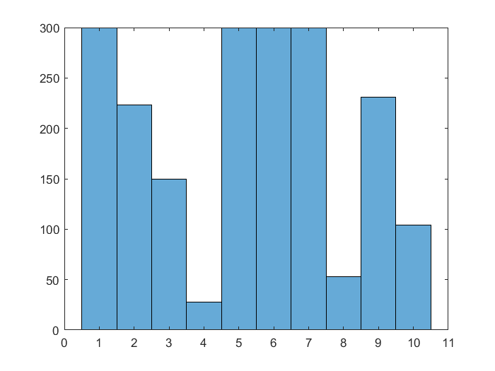
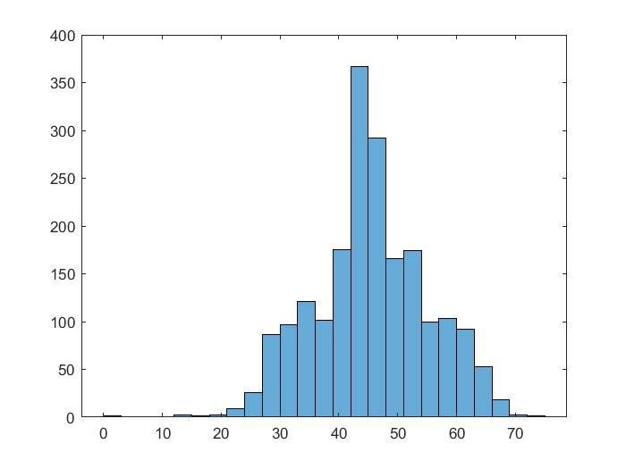

# Integer Linear Programming Model for Optimizing  Connected Start Network Topology 

```
>> ClusterAssignment_LP
LP:                Optimal objective value is 89530.000000.                                         


Optimal solution found.

Intlinprog stopped at the root node because the objective value is within a gap tolerance of the optimal value,
options.AbsoluteGapTolerance = 0 (the default value). The intcon variables are integer within tolerance,
options.IntegerTolerance = 1e-05 (the default value).
```


